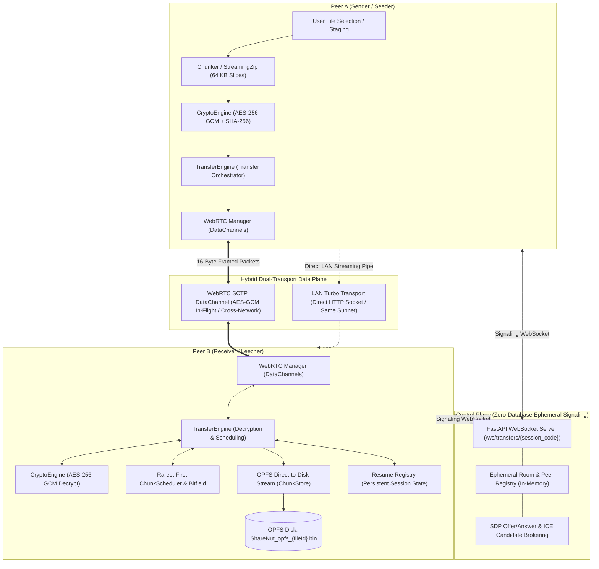

<p align="center">
  
</p>

<h1 align="center">ShareNut</h1>

<p align="center">
  <strong>Ultra-Fast, Zero-Cloud, High-Performance Decentralized P2P & LAN Mesh File Transfer Platform</strong>
</p>

<p align="center">
  <a href="LICENSE"></a>
  <a href="https://nextjs.org/"></a>
  <a href="https://react.dev/"></a>
  <a href="https://tailwindcss.com/"></a>
  <a href="https://ui.shadcn.com/"></a>
  <a href="https://github.com/pmndrs/zustand"></a>
  <a href="https://fastapi.tiangolo.com/">
    
  </a>
  <a href="https://webrtc.org/"></a>
  <a href="https://developer.mozilla.org/en-US/docs/Web/API/SubtleCrypto"></a>
  <a href="https://web.dev/articles/origin-private-file-system"></a>
  <a href="https://github.com/astral-sh/uv"></a>
  <a href="https://bun.sh/"></a>
</p>

---

## Overview

**ShareNut** is a cloudless, peer-to-peer file transfer engine built for modern web browsers. It eliminates centralized file servers and paid cloud storage silos by streaming files directly between devices using **WebRTC SCTP DataChannels** across the public internet and a **high-speed LAN Turbo Transport** over local Wi-Fi.

Engineered with a **BitTorrent-inspired swarm architecture**, files are divided into deterministic 64 KB slices, encrypted in-flight using **AES-256-GCM** via the native **Web Crypto API**, and piped directly into the browser's sandboxed **Origin Private File System (OPFS)**. This direct-to-disk pipeline enables sending **large multi-gigabyte transfers** with near-zero memory footprint (< 2 MB RAM) and zero risk of browser tab crashes.

---

## Table of Contents

- [Key Features](#key-features)
- [Tech Stack](#tech-stack)
- [User Guide & Step-by-Step Usage](#user-guide--step-by-step-usage)
  - [Sending Files (Desktop or Mobile)](#1-sending-files-desktop-or-mobile)
  - [Receiving Files](#2-receiving-files)
  - [Interrupted Transfer Recovery (Resume Engine)](#3-interrupted-transfer-recovery-resume-engine)
  - [Inspecting Chunks & Real-Time Telemetry](#4-inspecting-chunks--real-time-telemetry)
- [System Architecture](#system-architecture)
  - [Architecture Flowchart](#architecture-flowchart)
  - [Control Plane vs. Data Plane](#control-plane-vs-data-plane)
  - [Subsystem Deep Dives](#subsystem-deep-dives)
- [Security & Cryptography](#security--cryptography)
  - [In-Flight AES-256-GCM Chunk Encryption](#in-flight-aes-256-gcm-chunk-encryption)
  - [Bit-for-Bit SHA-256 Integrity Verification](#bit-for-bit-sha-256-integrity-verification)
  - [Transport Security & Zero-Storage Guarantees](#transport-security--zero-storage-guarantees)
- [16-Byte Binary Framing Protocol](#16-byte-binary-framing-protocol)
- [Repository Structure](#repository-structure)
- [Getting Started & Local Setup](#getting-started--local-setup)
  - [Prerequisites](#prerequisites)
  - [Option A: One-Click Launcher (Windows PowerShell)](#option-a-one-click-launcher-windows-powershell)
  - [Option B: Manual Development Setup](#option-b-manual-development-setup)
- [Testing & Quality Assurance](#testing--quality-assurance)
- [Production Deployment Guide](#production-deployment-guide)
- [License](#license)

---

## Key Features

- **Zero Cloud Storage Cost**: Files stream peer-to-peer without ever touching or being cached on central servers.
- **In-Flight AES-256-GCM Encryption**: Each 64 KB chunk is encrypted with an isolated 12-byte initialization vector (IV) using the native browser Web Crypto API.
- **Zero-RAM OPFS Streaming**: Arriving binary chunks write straight to disk via the Origin Private File System (`FileSystemWritableFileStream`), handling multi-gigabyte transfers with flat RAM.
- **BitTorrent Rarest-First Swarming**: Multi-peer chunk scheduler prioritizes rarest slices across the room, converting every receiver into an active seeder.
- **Hybrid Dual-Transport**: Automatically switches between WebRTC SCTP DataChannels (cross-network internet) and direct HTTP streaming sockets (same Wi-Fi LAN).
- **Modern Design with Tailwind CSS v4 & shadcn/ui**: Bespoke, accessible user interface crafted with Tailwind CSS v4 and Radix UI primitives, featuring interactive telemetry gauges and chunk visualizers.
- **Reactive Zustand State Engine**: Granular client state management synchronizing peer discovery, live transfer telemetry, and room status without unnecessary React component tree re-renders.
- **Frictionless QR Code Pairing**: Display instant session codes or scan dynamic QR codes using your device camera to connect mobile phones to desktops in seconds.
- **Session Continuity & Resumption**: Network drops and tab reloads preserve transfer progress via `ResumeRegistry` and OPFS chunk offset checks.
- **On-the-Fly Streaming ZIP**: Multi-file packages and directory trees compress dynamically on-the-fly without creating temp files on disk.

---

## Tech Stack

| Layer                         | Technology                                                                               | Version / Spec                  | Purpose                                                                                                               |
| :---------------------------- | :--------------------------------------------------------------------------------------- | :------------------------------ | :-------------------------------------------------------------------------------------------------------------------- |
| **Frontend Framework**        | [Next.js](https://nextjs.org/)                                                           | `16.3` (App Router)             | High-performance React framework with Turbopack compilation and client-side streaming                                 |
| **UI Library**                | [React](https://react.dev/)                                                              | `19.2`                          | Component architecture leveraging concurrent rendering primitives                                                     |
| **Design System & Styling**   | [Tailwind CSS](https://tailwindcss.com/)                                                 | `v4.0` (`@tailwindcss/postcss`) | CSS-first architecture using `@import "tailwindcss";`, `@theme inline` variables, and zero runtime CSS overhead       |
| **Accessible UI Primitives**  | [shadcn/ui](https://ui.shadcn.com/)                                                      | Radix UI Primitives             | Accessible dialogs, dropdown menus, progress bars, switches, badges, data tables, and Lucide React icons              |
| **Client State Management**   | [Zustand](https://github.com/pmndrs/zustand)                                             | `v5.0`                          | High-speed reactive store orchestrating peer discovery, room lifecycle, and live telemetry without render bottlenecks |
| **P2P Transport**             | [WebRTC](https://webrtc.org/)                                                            | SCTP `RTCDataChannel`           | Direct browser-to-browser encrypted data plane with zero intermediate server relays                                   |
| **Local Storage Engine**      | [Origin Private File System (OPFS)](https://web.dev/articles/origin-private-file-system) | W3C File System Access API      | Random-access streaming directly to disk via `FileSystemWritableFileStream` with flat memory footprint                |
| **In-Flight Cryptography**    | [Web Crypto API](https://developer.mozilla.org/en-US/docs/Web/API/SubtleCrypto)          | Hardware `SubtleCrypto`         | Native AES-256-GCM chunk encryption with isolated 12-byte IVs and bit-for-bit SHA-256 digest validation               |
| **Control Plane / Signaling** | [FastAPI](https://fastapi.tiangolo.com/)                                                 | `0.115+`                        | High-concurrency async Python WebSocket signaling server, ephemeral memory-only room routing                          |
| **Python Toolchain**          | [uv](https://github.com/astral-sh/uv)                                                    | Latest                          | Ultra-fast package installer, virtual environment resolver, and script runner                                         |
| **JS Runtime & Bundler**      | [Bun](https://bun.sh/)                                                                   | `1.3+`                          | High-speed JavaScript runtime, package manager, and native unit test execution engine                                 |

---

## User Guide & Step-by-Step Usage

### 1. Sending Files (Desktop or Mobile)

1. **Launch the App**: Navigate to the ShareNut Dashboard (`http://localhost:3000/dashboard` or your deployed URL).
2. **Select or Drop Files**: Drag and drop any file or folder into the staging zone, or click **Select Files / Folders**.
3. **Session Code Generation**: ShareNut generates an ephemeral session code (e.g., `NUT-9X2F`) along with an interactive QR code.
4. **Share with Recipient**: Share the code, copy the one-click invitation link, or display the QR code for mobile scanning.
5. **Streaming Starts Automatically**: Once the recipient connects, chunks begin streaming immediately with live throughput metrics.

### 2. Receiving Files

1. **Join the Session**: Open the Dashboard on the receiving device and enter the session code, or scan the sender's QR code with the built-in camera scanner.
2. **Peer Handshake**: The browser establishes a direct WebRTC peer connection (or local LAN pipe).
3. **Live Progress Monitoring**: Monitor incoming chunks on the interactive progress bar, live speed gauge, and chunk status matrix.
4. **Direct-to-Disk Assembly**: As the final chunk arrives, the OPFS file handle finalizes and automatically triggers the browser download prompt.

### 3. Interrupted Transfer Recovery (Resume Engine)

If your Wi-Fi disconnects or your browser tab is accidentally refreshed:

1. Re-open the Dashboard and join the same session code.
2. ShareNut automatically detects existing partial chunks stored in OPFS (`ShareNut_opfs_{fileId}.bin`).
3. The engine verifies the online presence of the sender peer and sends delta `REQUEST_CHUNK` packets _only_ for missing byte offsets.
4. The transfer seamlessly picks up exactly where it paused without re-downloading completed chunks.

### 4. Inspecting Chunks & Real-Time Telemetry

Click **Inspect Chunks** on any ongoing or completed transfer:

- **Visual Chunk Grid**: View every 64 KB chunk color-coded by state (`Verified`, `In-Flight`, `Pending`).
- **Cryptographic Audit**: Click any chunk to view its exact byte offset, slice length, and verified **SHA-256 hex digest**.
- **Copy Digest**: One-click copy chunk digests for bit-for-bit manual verification.

---

## System Architecture

ShareNut separates concerns into an ephemeral **Control Plane** (signaling and session discovery) and a direct **Data Plane** (encrypted peer-to-peer data transport).

### Architecture Flowchart



### Control Plane vs. Data Plane

| Feature             | Control Plane                                              | Data Plane                                                      |
| :------------------ | :--------------------------------------------------------- | :-------------------------------------------------------------- |
| **Protocol**        | WebSockets over TLS (`wss://`)                             | WebRTC SCTP DataChannels (`RTCDataChannel`) / HTTP LAN Stream   |
| **Server Role**     | Ephemeral signaling relay                                  | **None** (Bypasses server completely)                           |
| **Payload Storage** | Zero bytes stored; in-memory rooms destroyed on disconnect | Direct-to-disk streaming inside client OPFS                     |
| **Data Handled**    | JSON signaling: `JOIN`, `OFFER`, `ANSWER`, `ICE_CANDIDATE` | Binary 16-byte framed packets containing encrypted 64 KB slices |
| **Bandwidth Cost**  | Kilobytes of text metadata                                 | Unthrottled direct peer network capacity                        |

### Subsystem Deep Dives

1. **Signaling Server (`backend/app/websockets/`)**:
   - Built on FastAPI and asynchronous WebSockets.
   - Rooms exist purely in-memory (`rooms: dict[str, dict[str, WebSocket]]`).
   - Automatically purges room state when all peers disconnect.
2. **Chunker & Streaming ZIP (`frontend/src/features/transfer/engine/`)**:
   - `Chunker.ts`: Slices files into deterministic chunks (default 65,504 bytes payload + 16 bytes framing = 65,520 bytes).
   - `StreamingZip.ts`: Utilizes `client-zip` to stream directories and multi-file archives on-the-fly without temporary buffer files.
3. **Origin Private File System Storage (`ChunkStore.ts`)**:
   - Acquires browser root storage via `navigator.storage.getDirectory()`.
   - Opens a dedicated `FileSystemWritableFileStream` for each transfer.
   - Performs out-of-order random-access writes directly at computed byte offsets ($\text{index} \times \text{chunkSize}$).
4. **Bitfield & Rarest-First Scheduler (`frontend/src/features/p2p/`)**:
   - `Bitfield.ts`: Compact bit-array tracking chunk possession across peers.
   - `Scheduler.ts`: Implements rarest-first chunk prioritization, preventing peer starvation in multi-peer swarm environments.
   - **End-Game Mode**: Requests remaining 5% missing chunks in parallel from all connected nodes to eliminate tail latency.
5. **Reactive State & Modern Design System (`frontend/src/`)**:
   - **Zustand (`features/mesh/peerStore.ts`)**: Decouples UI rendering from high-frequency WebRTC binary packet arrival (hundreds of chunks/sec). Components subscribe only to granular slice selectors, preventing full-tree React re-renders during peak throughput.
   - **Tailwind CSS v4 & shadcn/ui (`components/ui/`, `app/globals.css`)**: Built using Tailwind v4's CSS-first `@import "tailwindcss";` pipeline, providing accessible Radix UI dialogs, interactive chunk matrices, speed gauges, and warm amber theme tokens.

---

## Security & Cryptography

### In-Flight AES-256-GCM Chunk Encryption

Every chunk is individually encrypted prior to transmission using the browser's hardware-accelerated **Web Crypto API (`SubtleCrypto`)**:

```text
[ 12 Bytes: Unique IV ] + [ Ciphertext (Encrypted Chunk) ] + [ 16 Bytes: GCM Auth Tag ]
```

- **Key Derivation**: A 256-bit AES-GCM key is derived from the session code using `crypto.subtle.digest("SHA-256", sessionCode)` and cached in memory.
- **Unique IV per Slice**: Every 64 KB slice generates a cryptographically random 12-byte IV (`crypto.getRandomValues`).
- **In-Flight Discard**: Raw slices are encrypted, transmitted over the DataChannel, and immediately garbage-collected from RAM.
- **Authenticity Assurance**: The 16-byte GCM authentication tag guarantees tamper detection; tampered packets fail decryption automatically.

### Bit-for-Bit SHA-256 Integrity Verification

Upon receiving and decrypting each chunk, `CryptoEngine.computeSha256` computes its cryptographic digest:

- The receiver compares the chunk digest against the sender's manifest.
- Mismatched or corrupted chunks are rejected and re-requested.
- Guarantees 100% bit-for-bit file delivery across any network route.

### Transport Security & Zero-Storage Guarantees

- **Mandatory DTLS**: WebRTC DataChannels enforce end-to-end encryption at the transport layer using DTLS with SCTP.
- **Double-Layered Defense**: Slices are protected by **both** WebRTC transport DTLS and application-layer **AES-256-GCM**.
- **No Third-Party Tracking**: Zero telemetry, zero analytics scripts, and zero permanent database storage.

---

## 16-Byte Binary Framing Protocol

All binary packets traveling across DataChannels use a compact, 16-byte protocol header followed by the binary chunk payload:

```text
 0                   1                   2                   3
 0 1 2 3 4 5 6 7 8 9 0 1 2 3 4 5 6 7 8 9 0 1 2 3 4 5 6 7 8 9 0 1
+-+-+-+-+-+-+-+-+-+-+-+-+-+-+-+-+-+-+-+-+-+-+-+-+-+-+-+-+-+-+-+-+
|  Magic (0x50) |  Packet Type  |          File Seq ID          |
+-+-+-+-+-+-+-+-+-+-+-+-+-+-+-+-+-+-+-+-+-+-+-+-+-+-+-+-+-+-+-+-+
|                          Chunk Index                          |
+-+-+-+-+-+-+-+-+-+-+-+-+-+-+-+-+-+-+-+-+-+-+-+-+-+-+-+-+-+-+-+-+
|                         Payload Length                        |
+-+-+-+-+-+-+-+-+-+-+-+-+-+-+-+-+-+-+-+-+-+-+-+-+-+-+-+-+-+-+-+-+
|                           Timestamp                           |
+-+-+-+-+-+-+-+-+-+-+-+-+-+-+-+-+-+-+-+-+-+-+-+-+-+-+-+-+-+-+-+-+
|               Binary Chunk / Encrypted Payload                |
|                           ...                                 |
+-+-+-+-+-+-+-+-+-+-+-+-+-+-+-+-+-+-+-+-+-+-+-+-+-+-+-+-+-+-+-+-+
```

### Protocol Header Fields

| Offset (Bytes) | Field              |   Type   | Description                                                                          |
| :------------: | :----------------- | :------: | :----------------------------------------------------------------------------------- |
|      `0`       | **Magic Byte**     | `uint8`  | Constant identifier `0x50` (ASCII `'P'`) for instant packet validation.              |
|      `1`       | **Packet Type**    | `uint8`  | OpCode determining packet action and payload type (`0x01` – `0x0C`).                 |
|    `2 - 3`     | **File Seq ID**    | `uint16` | Sequence identifier mapping chunks to the active file transfer manifest.             |
|    `4 - 7`     | **Chunk Index**    | `uint32` | 0-based chunk index within the file. For ping/pong, holds the microsecond timestamp. |
|    `8 - 11`    | **Payload Length** | `uint32` | Length of the subsequent payload in bytes (`0` for control messages).                |
|   `12 - 15`    | **Timestamp**      | `uint32` | Unix epoch timestamp (seconds) or high-resolution clock reading.                     |
|     `16+`      | **Payload**        | `binary` | Binary chunk slice (AES-256-GCM encrypted) or JSON-encoded metadata.                 |

### Protocol OpCodes

| OpCode | Identifier          | Description                                                                                     |
| :----: | :------------------ | :---------------------------------------------------------------------------------------------- |
| `0x01` | `CHUNK_DATA`        | Carries sliced binary chunk data (AES-GCM encrypted payload).                                   |
| `0x02` | `MANIFEST`          | Broadcasts file metadata (name, byte size, MIME type, chunk count, hashes).                     |
| `0x03` | `REQUEST_CHUNK`     | Targeted request from receiver to peer for a specific chunk index.                              |
| `0x04` | `HAVE_CHUNK`        | Broadcast informing peers that a specific chunk index is verified and ready for seeder sharing. |
| `0x05` | `TRANSFER_PAUSE`    | Signals transfer pause request across the peer channel.                                         |
| `0x07` | `TRANSFER_COMPLETE` | Terminal handshake acknowledging full file receipt and disk flush.                              |
| `0x08` | `TRANSFER_CANCEL`   | Abort signal tearing down session state and cleaning temporary files.                           |
| `0x09` | `LAN_MANIFEST`      | Manifest exchange for high-speed same-network HTTP streaming.                                   |
| `0x0A` | `LAN_PROGRESS`      | Progress lockstep synchronization for LAN transfers.                                            |
| `0x0B` | `PING`              | High-frequency latency measurement probe.                                                       |
| `0x0C` | `PONG`              | Heartbeat response returning original timestamp for round-trip latency tracking.                |

### Congestion Control & Backpressure (`DataChannelBackpressure`)

WebRTC data channels can drop packets if chunks are dispatched faster than the underlying SCTP socket can flush. ShareNut implements adaptive backpressure:

- Monitors `RTCDataChannel.bufferedAmount` against high-water marks.
- Sets `bufferedAmountLowThreshold` to automatically pause chunk encoding until the browser's network buffer drains below the threshold.
- Eliminates memory ballooning and prevents socket disconnection on gigabit LAN or high-latency mobile networks.

---

## Repository Structure

```text
ShareNut/
├── backend/                        # Python FastAPI Signaling Service
│   ├── app/
│   │   ├── api/v1/                 # REST routing
│   │   │   ├── api.py              # Primary v1 API router aggregation
│   │   │   ├── lan_transfer.py     # Local subnet HTTP streaming pipe
│   │   │   ├── network.py          # Host network and LAN IP route discovery
│   │   │   └── transfers.py        # File staging & session query endpoints
│   │   ├── websockets/             # In-memory ephemeral WebRTC signaling engine
│   │   │   ├── manager.py          # Room lifecycle, peer registry, broadcast dispatch
│   │   │   └── router.py           # WebSocket route (/ws/transfers/{session_code})
│   │   ├── config.py               # Pydantic environment configuration & CORS settings
│   │   ├── main.py                 # FastAPI application definition & lifespan management
│   │   └── schemas.py              # Signaling message contracts & Pydantic DTOs
│   ├── .python-version             # Python 3.12 version pinning
│   ├── pyproject.toml              # Python project metadata (>=3.12)
│   ├── requirements.txt            # Python dependencies
│   └── uv.lock                     # UV dependency lockfile
│
├── frontend/                       # Next.js 16 + React 19 Client Web Application
│   ├── public/                     # Static media & brand assets
│   │   ├── images/                 # Architecture diagrams (arch.png, ShareNut.png)
│   │   ├── favicon.ico             # App favicon
│   │   └── sharenut-logo.png       # Official ShareNut brand logo
│   ├── src/
│   │   ├── app/                    # Next.js App Router (dashboard, about, architecture, transfers)
│   │   │   ├── about/              # About ShareNut page
│   │   │   ├── architecture/       # Interactive system architecture page
│   │   │   ├── dashboard/          # Transfer workspace, active transfers & mesh panels
│   │   │   ├── devices/            # Mesh devices & peer connection explorer
│   │   │   ├── faq/                # Frequently asked questions
│   │   │   ├── privacy/            # Privacy policy & zero-storage guarantees
│   │   │   ├── security/           # DTLS, Web Cryptography & security architecture
│   │   │   ├── transfers/          # Transfer views & live telemetry
│   │   │   ├── globals.css         # Tailwind CSS v4 design system styles
│   │   │   ├── layout.tsx          # Root layout with fonts & theme provider
│   │   │   └── page.tsx            # Landing page
│   │   ├── components/             # Reusable UI primitives & layouts
│   │   │   ├── landing/            # Hero, features, FAQ, and tech stack landing sections
│   │   │   ├── layout/             # Application navbar, footer, and navigation shells
│   │   │   └── ui/                 # Accessible UI components (shadcn/ui & Radix UI)
│   │   ├── features/               # Modular domain feature engines
│   │   │   ├── dashboard/          # Quick-action transfer cards & room controls
│   │   │   ├── mesh/               # Connected devices, live topology & Zustand peerStore
│   │   │   ├── p2p/                # WebRTC, Bitfield, and Rarest-First Scheduler
│   │   │   ├── settings/           # Configurable ICE STUN & backpressure stores
│   │   │   ├── sharing/            # QR code generator, camera QR scanner, share modals
│   │   │   └── transfer/           # Core Transfer Engine
│   │   │       ├── components/     # Transfer table, chunk inspector modal, progress gauges
│   │   │       └── engine/
│   │   │           ├── lan/        # LAN Turbo Transport & Network Route Prober
│   │   │           ├── web/        # WebRTC Binary Framing & Transfer Handler
│   │   │           ├── CancelManager.ts# Transfer cancellation lifecycle
│   │   │           ├── ChunkStore.ts   # Origin Private File System (OPFS) direct-to-disk write
│   │   │           ├── Chunker.ts      # 64 KB slicing engine & manifest generator
│   │   │           ├── CryptoEngine.ts # In-flight AES-GCM encryption & SHA-256 hashing
│   │   │           ├── EngineContext.tsx# React context provider for transfer engine
│   │   │           ├── ResumeRegistry.ts# Session recovery registry
│   │   │           ├── SessionManager.ts# Session code management
│   │   │           ├── StagingManager.ts# File preparation & staging
│   │   │           ├── StreamingZip.ts # On-the-fly multi-file ZIP packaging
│   │   │           ├── TransferEngine.ts# State machine & swarm orchestrator
│   │   │           └── engineTypes.ts  # Engine type contracts
│   │   ├── lib/                    # Byte formatting, utils & helper functions
│   │   ├── services/               # REST API client services (api.ts)
│   │   └── types/                  # Protocol & data type definitions
│   ├── bun.lock                    # Bun package lockfile
│   ├── eslint.config.mjs           # ESLint configuration
│   ├── next.config.ts              # Next.js configuration & API rewrites
│   ├── package.json                # Frontend dependencies
│   ├── postcss.config.mjs          # PostCSS configuration
│   └── tsconfig.json               # TypeScript configuration
│
├── tests/                          # Automated Verification Suite
│   ├── CryptoEngine.test.ts        # Unit test: AES-GCM streaming encryption & SHA-256 digests
│   └── browser_mesh/               # Playwright multi-browser headless swarm test
│       ├── bun.lock                # Lockfile for test runner dependencies
│       ├── generate_payload.ts     # Deterministic binary payload generator
│       ├── package.json            # Test runner dependencies
│       ├── run_mesh_browser_test.ts# Multi-peer automated transfer simulation
│       └── runner.mjs              # Test runner orchestration script
│
├── .env.example                    # Environment variable template
├── LICENSE                         # Apache 2.0 open-source license
├── README.md                       # Platform documentation
└── start.ps1                       # One-click Windows PowerShell dev launcher
```

---

## Getting Started & Local Setup

### Prerequisites

- **uv** (Fast Python package and project manager)
- **Python 3.12+** (managed automatically via `uv`)
- **Bun 1.2+** (or **Node.js 20+**)
- Modern web browser with OPFS support (Google Chrome, Microsoft Edge, Brave, Mozilla Firefox, or Apple Safari).

---

### Option A: One-Click Launcher (Windows PowerShell)

ShareNut includes an automated launcher that starts both the backend and frontend simultaneously:

```powershell
.\start.ps1
```

- **Frontend Application**: `http://localhost:3000`
- **FastAPI Backend & Swagger**: `http://localhost:8000/docs`

---

### Option B: Manual Development Setup

#### 1. Backend Setup (using uv)

```bash
cd backend

# Install locked dependencies using uv
uv sync

# Start FastAPI signaling server
uv run uvicorn app.main:app --host 0.0.0.0 --port 8000 --reload
```

#### 2. Frontend Setup

```bash
cd frontend

# Install dependencies
bun install
# Or: npm install

# Start Next.js development server
bun run dev
# Or: npm run dev
```

Open `http://localhost:3000` in your browser.

---

## Testing & Quality Assurance

### 1. In-Flight Cryptography & Slicing Unit Tests

Run the native Bun test suite covering AES-GCM 64 KB encryption, tampering detection, and SHA-256 digests:

```bash
bun test tests/CryptoEngine.test.ts
```

Output:

```text
tests/CryptoEngine.test.ts:
✓ CryptoEngine > encrypts and decrypts a 64 KB chunk bit-for-bit
✓ CryptoEngine > produces unique IVs and ciphertexts for identical chunks
✓ CryptoEngine > gracefully catches tampered ciphertext
✓ CryptoEngine > computes accurate SHA-256 hex digest
✓ CryptoEngine > completes full multi-chunk stream with BinaryFraming bit-for-bit

5 pass, 0 fail [151ms]
```

### 2. Frontend Production Build & Typecheck

Validate TypeScript types and Turbopack bundle compilation:

```bash
cd frontend
bun run build
```

### 3. Headless Multi-Peer Mesh Test

Simulate a live multi-peer file transfer using automated Playwright browser instances:

```bash
cd tests/browser_mesh
bun install
bun run run_mesh_browser_test.ts
```

---

## Production Deployment Guide

Deploying ShareNut across the internet involves deploying the frontend to a global edge CDN and hosting the backend on a persistent WebSocket-capable host:

| Service            | Recommended Host                       | Configuration                                                                                                     |
| :----------------- | :------------------------------------- | :---------------------------------------------------------------------------------------------------------------- |
| **Frontend**       | **Vercel** or **Netlify**              | Set `NEXT_PUBLIC_API_URL=https://api.yourdomain.com/api`<br/>Set `NEXT_PUBLIC_WS_URL=wss://api.yourdomain.com/ws` |
| **Backend**        | **Render**, **Railway**, or **Fly.io** | Set `CORS_ORIGINS=https://your-frontend.vercel.app`<br/>Runs 24/7 with persistent WebSockets (`wss://`)           |
| **STUN Discovery** | **Google STUN** (Default)              | Built into `DEFAULT_ICE_SERVERS` (`stun.l.google.com:19302`) with no external setup required                      |

---

## License

Distributed under the [Apache 2.0 License](LICENSE). Built for high-performance, decentralized, private data transfer.
